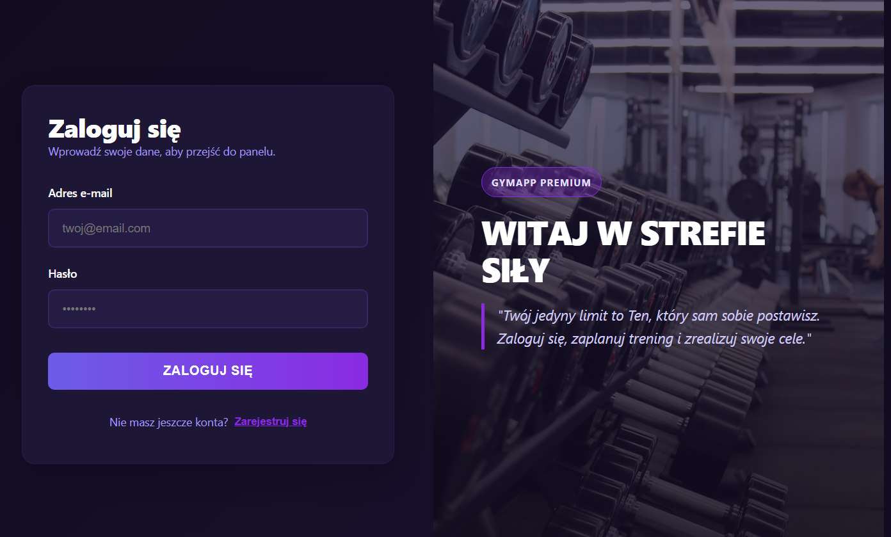
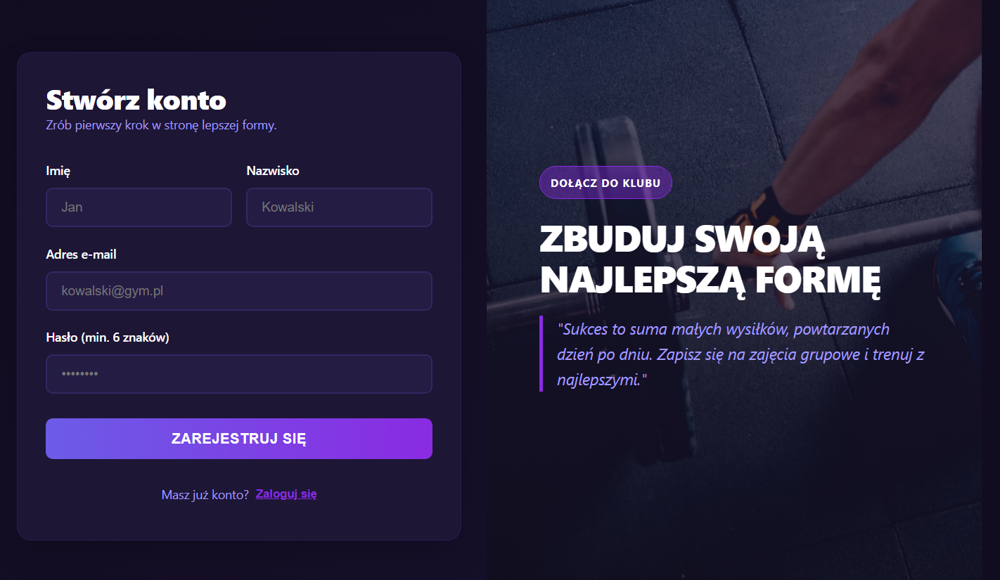
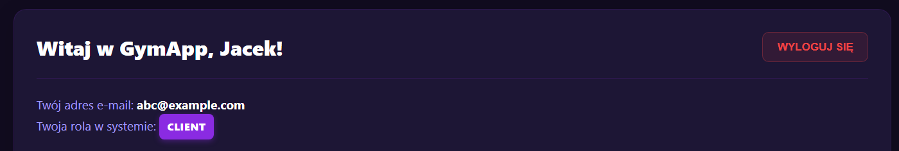
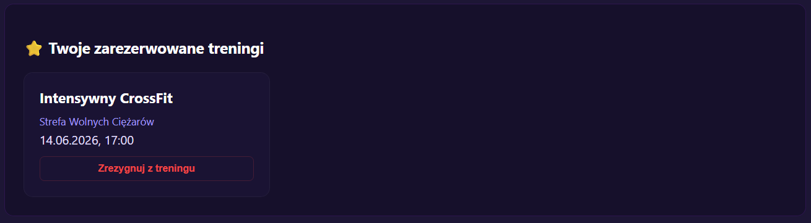
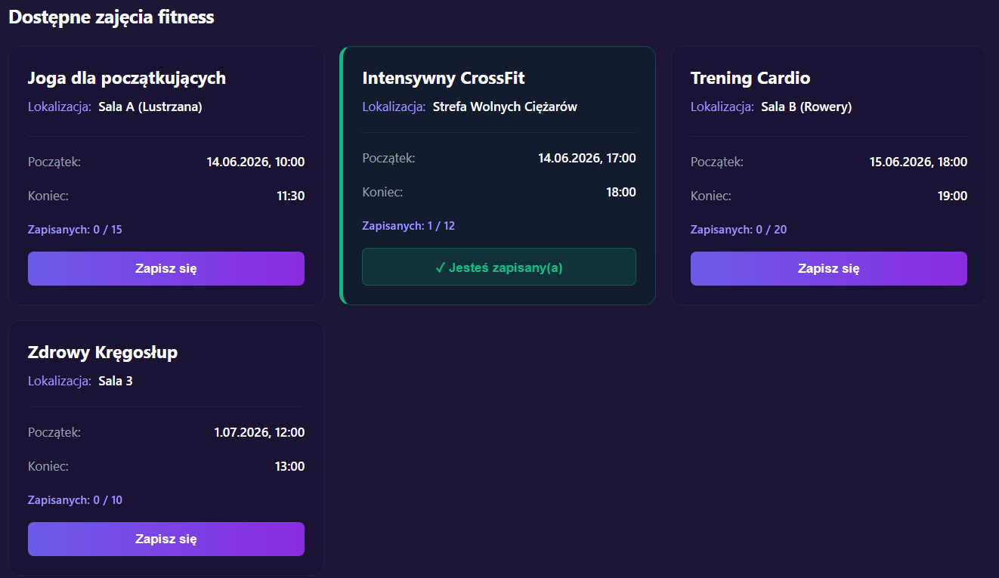
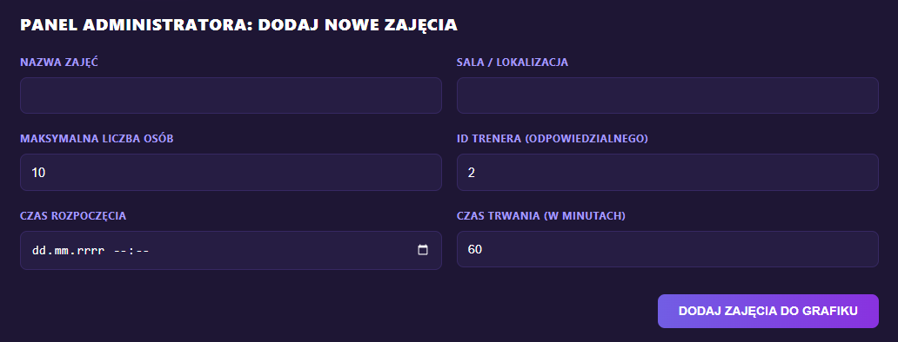
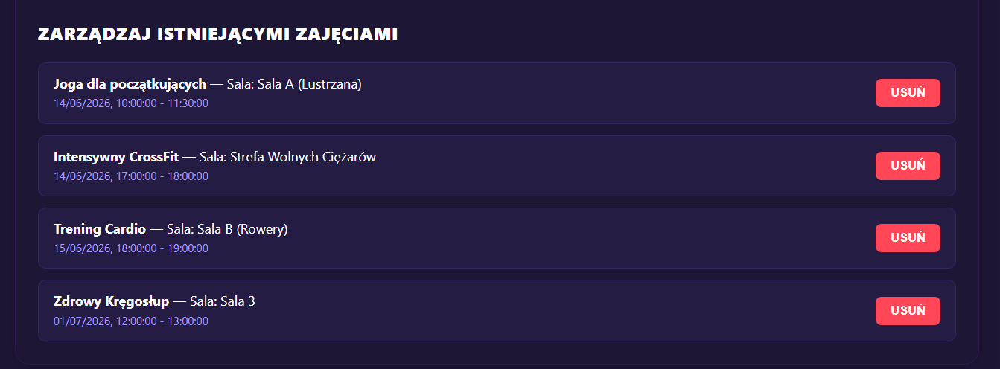
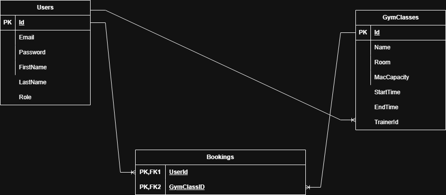

# Uruchamianie aplikacji

## Potrzebne narzędzia

* Visual Studio 2022 lub nowsze
* Node.js (w wersji LTS - zalecana wersja 18 lub nowsza)
* SQL Server Express LocalDB

## Konfiguracja i uruchomienie bazy danych

W konsoli managera pakietów Nuget należy wpisać polecenie `Update-Database -Project GymApp.Server -StartupProject GymApp.Server`.

## Instalacja zależności i uruchumienie Frontendu

W terminalu w folderze projektu `gymapp.client` należy wpisać następujące polecenia:

```
npm install
npm run dev
```
## Pierwsze odpalenie aplikacji

Po wykonaniu powyższych kroków należy wejść w ustawienia głównego rozwiązania i w zakładce *Startup project* zaznaczyć opcję *Multiple startup projects* oraz ustawić zarówno `GymApp.Server`, jak i `gymapp.client` na *start*. Od tego momentu naciśnięcie zielonej strzałki z napisem *Start* powinno uruchamiać aplikację.

# Elementy dziłającej aplikacji

## Ekran logowania



Pierwszy ekran jaki pojawia się po uruchomieniu strony. Można się tutaj zalogować przy wykorzystaniu intuicyjnego formularza lub nacisnąć przycisk "Zarejestruj się", jeżeli nie ma się jeszcze konta.

## Ekran rejestracji



Korzystając z formularza na stronie można założyć konto. Oczywiście e-mail musi przejść walidację oraz hasło musi spełniać wymagania (musi być długie na minimum 6 znaków).

## Ekran użytkownika

### Powitanie, e-mail oraz rola użytkownika



Po zalogowaniu się na samej górze pojawia się nagłowek z powitaniem; przycisk, który umożliwia wylogowanie się; wyświetlają się tam również adres e-mail przypisany do konta i rola konta w systemie (klient, trener lub administrator).

### Zarezerwowane treningi



Poniżej znajduje się fragment strony, na którym wyświetla się lista zajęć, na które się zapisaliśmy. Znajdują się tu informacje o czasie treningu oraz jego położeniu. Można tam również odwołać rezerwację i zwolnić miejsce dla kogoś innego, jeżeli akurat nie możemy się pojawić. Przed przypadkowym wypisanym z zajęć chroni nas okno dialogowe, w którym należy potwierdzić rezygnację z rezerwacji. Jeżeli nie jesteśmy zapisani na żaden trening to ta sekcja strony nie pojawia się.

### Dostępne zajęcia



Na samym dole strony znajduje się lista zajęć, na które możemy się zapisać oraz liczba dostępnych na nich miejsc. Tutaj również są informacje o czasie położeniu treningów. Po kliknięciu "Zapisz się" pojawia się napis "Jesteś zapisany(a)", a kolor kafelka zmienia się na zielony.

## Ekran administratora

Jeżeli jesteśmy zalogowani na konto z uprawnieniami administratora pojawiają się dwa dodatkowe panele.

### Dodawanie zajęć



W pierwszym panelu możemy dodawać zajęcia. Należy wypełnić odpowiedni formularz, żeby pojawiły się zajęcia przypisane do odpowiedniego prowadzącego. Od razu po dodaniu zajęć klienci mogą się na nie rejestrować.

### Usuwanie zajęć



Znajduje się tu lista wszystkich zajęć. Jeżeli z jakiegoś powodu zajęcia nie mogą się odbyć, można je usunąć za pomocą czerwonego przycisku po prawej stronie panelu.

# API

Backend aplikacji działa jako bezstanowe Web API. Wszystkie punkty końcowe (endpoints) komunikują się za pomocą formatu JSON.

## Moduł Uwierzytelniania i Rejestracji (AuthController)

`POST /api/auth/register`

Rejestracja nowego użytkownika w systemie. Domyślna rola to Client.

Ciało żądania (JSON):
```JSON
{
  "Email": "jan.kowalski@example.com",
  "Password": "SecurePassword123!",
  "FirstName": "Jan",
  "LastName": "Kowalski"
}
```
Odpowiedź (Sukces 200 OK): "Rejestracja powiodła się pomyślnie."

`POST /api/auth/login`

Logowanie do aplikacji i weryfikacja haseł.

Ciało żądania (JSON):
```JSON
{
  "Email": "jan.kowalski@example.com",
  "Password": "SecurePassword123!"
}
```
Odpowiedź (Sukces 200 OK): Zwraca pełny obiekt zalogowanego użytkownika (wykorzystywany przez frontend do zapisu w localStorage).

```JSON
{
  "id": 5,
  "email": "jan.kowalski@example.com",
  "firstName": "Jan",
  "lastName": "Kowalski",
  "role": "Client"
}
```

## Moduł Grafiku i Rezerwacji (GymClassesController)

`GET /api/gymclasses`

Pobiera pełną listę wszystkich zajęć fitness wraz z dynamicznie obliczoną liczbą zapisanych osób.

Odpowiedź (Sukces 200 OK):

```JSON
[
  {
    "id": 1,
    "name": "CrossFit",
    "room": "Sala A",
    "maxCapacity": 15,
    "currentEnrollment": 4,
    "startTime": "2026-06-20T18:00:00",
    "endTime": "2026-06-20T19:00:00",
    "trainerId": 1
  }
]
```

`GET /api/gymclasses/user/{userId}`

Pobiera listę zajęć, na które zapisany jest zalogowany użytkownik (w celu wyrenderowania sekcji "Twoje nadchodzące treningi").

Odpowiedź (Sukces 200 OK): Tablica obiektów GymClass (struktura identyczna jak wyżej).

POST /api/gymclasses

[Tylko Admin] Tworzy nowe zajęcia fitness. Zawiera walidację biznesową czasu trwania oraz dat wstecznych.

Ciało żądania (JSON):

```JSON
{
  "Name": "Zumba Gold",
  "Room": "Sala Lustrzana",
  "MaxCapacity": 20,
  "StartTime": "2026-06-22T17:00:00",
  "EndTime": "2026-06-22T18:00:00",
  "TrainerId": 1
}
```

Odpowiedź:

* 200 OK: "Zajęcia zostały pomyślnie dodane do grafiku!"
* 400 Bad Request: "Nie można utworzyć zajęć z datą wsteczną."

`POST /api/gymclasses/{id}/book?userId={userId}`

Zapisuje użytkownika o podanym userId na zajęcia o określonym {id}.

Odpowiedź: 200 OK (Sukces) lub 400 Bad Request (w przypadku braku miejsc lub próby dublowania zapisu).

`DELETE /api/gymclasses/{id}/cancel?userId={userId}`

Anuluje rezerwację (wypisanie z zajęć). Usuwa powiązanie z tabeli Bookings.

Odpowiedź: 200 OK: "Pomyślnie zrezygnowano z zajęć."

404 Not Found: "Nie znaleziono Twojej rezerwacji na te zajęcia."

# Diagram ERD



Diagram opisuje jak wyglądają encje, ich atrybuty oraz relacje miedzy nimi.